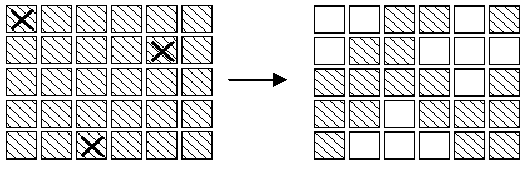
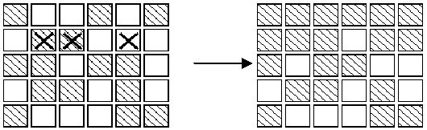
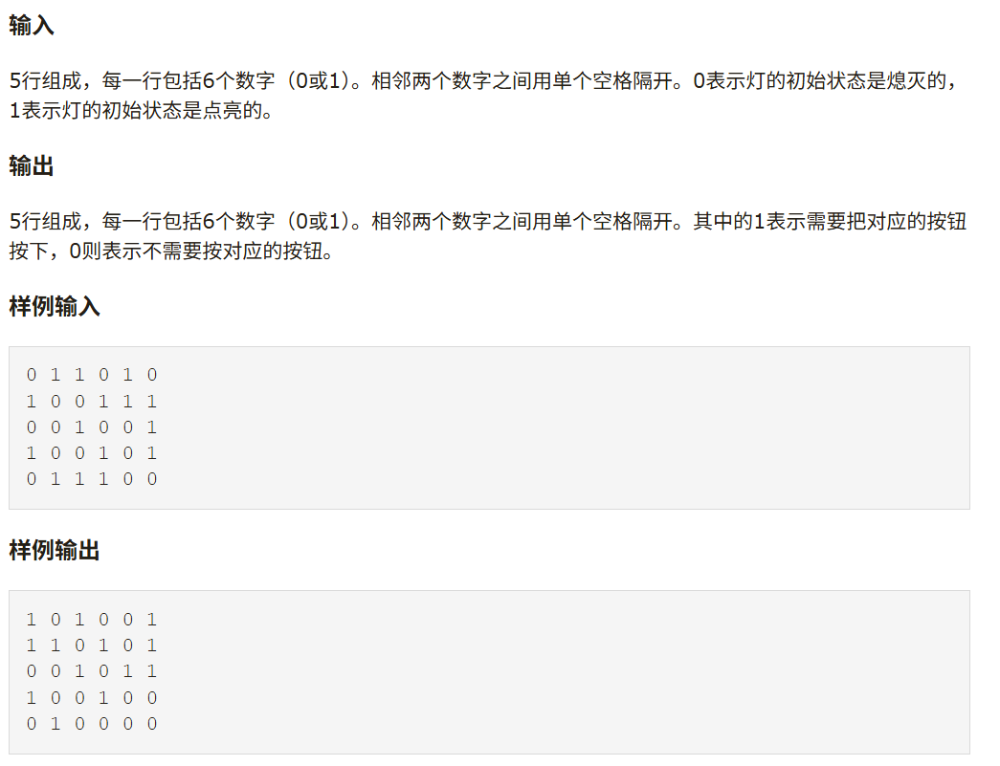

# 枚举
## 枚举的定义
枚举（英语：Enumerate）是基于已有知识来猜测答案的一种问题求解策略。不断尝试，直到成立为止。

## 要点
想一想枚举的时候会出现哪些问题？（时间是宝贵的）
- 可能的全部情况
- 枚举的范围
- 枚举的顺序

## 直接上题
给定一个数组，其所有元素互不相同且均不为 0。求该数组中和为 0 的数对个数。

O(n^2)
```cpp
for (int i = 0; i < n; ++i)
  for (int j = 0; j < n; ++j)
    if (a[i] + a[j] == 0) ++ans;
```

考虑到（a,b）和（b,a）是同一种情况，所以我们只需要枚举其中一种即可。
O(n^2)
```cpp
for (int i = 0; i < n; ++i)
  for (int j = i + 1; j < n; ++j)
    if (a[i] + a[j] == 0) ++ans;
ans*=2;
```

但是两个数是否都一定要枚举出来呢？
一个数确定了，另外的一个数算一下，再看看有没有就好了。
这里使用桶排序。

什么是桶排序？
桶排序（Bucket sort）或所谓的箱排序，是一个排序算法，工作的原理是将数组分到有限数量的桶里。每个桶再个别排序（有可能再使用别的排序算法或是以递归方式继续使用桶排序进行排序）。
 
 常见的作法就是搞一个大的数组，将array中的元素作为位置，将桶中的对应位置加一：
  ```cpp
  int a[maxn]=[1,2,3,4,5,6,7,8,9,10];
  for (int i = 0; i < n; ++i)
    bucket[a[i]]++;
  ```

继续：于是乎，我们遍历一遍数组就得出了答案（前人栽树后人乘凉）：
```cpp
#include <cstring>
constexpr int MAXN = 100000;  // 此处 MAXN 是数组内元素的界

int solve(int n, int a[]) {
  bool met[MAXN * 2 + 1];  // 创建一个能装下 [-MAXN, MAXN] 的桶
  memset(met, 0, sizeof(met));
  int ans = 0;
  for (int i = 0; i < n; ++i) {
    if (met[MAXN - a[i]]) ++ans;  // 如果桶内有想要的元素，答案加一
    met[MAXN + a[i]] = true;  // 无论如何，都要把当前元素放进桶里
  }
  return ans * 2;
}
```

## 练习 ：http://bailian.openjudge.cn/practice/2811/


有一个由按钮组成的矩阵，其中每行有6个按钮，共5行。每个按钮的位置上有一盏灯。当按下一个按钮后，该按钮以及周围位置(上边、下边、左边、右边)的灯都会改变一次。即，如果灯原来是点亮的，就会被熄灭；如果灯原来是熄灭的，则会被点亮。在矩阵角上的按钮改变3盏灯的状态；在矩阵边上的按钮改变4盏灯的状态；其他的按钮改变5盏灯的状态

用X标记的按钮表示被按下，右边的矩阵表示灯状态的改变。对矩阵中的每盏灯设置一个初始状态。请你按按钮，直至每一盏等都熄灭。与一盏灯毗邻的多个按钮被按下时，一个操作会抵消另一次操作的结果。在下图中，第2行第3、5列的按钮都被按下，因此第2行、第4列的灯的状态就不改变。

需要按下哪些按钮，恰好使得所有的灯都熄灭。根据上面的规则，我们知道1）第2次按下同一个按钮时，将抵消第1次按下时所产生的结果。因此，每个按钮最多只需要按下一次；2）各个按钮被按下的顺序对最终的结果没有影响；3）对第1行中每盏点亮的灯，按下第2行对应的按钮，就可以熄灭第1行的全部灯。如此重复下去，可以熄灭第1、2、3、4行的全部灯。同样，按下第1、2、3、4、5列的按钮，可以熄灭前5列的灯。

第一次尝试的时候的思路，对于每一个按钮，只有按与不按的两个选项，枚举的话直接2^30次方，会超时。

答案思路：(对着写了半个小时，然后过了，感觉效率堪忧)
- 从上到下（第0行到第4行）处理灯的状态。
- 第一行直接枚举，对于每一个状态，可能会出现符合的选项。
- 其他的直接贪心，用下一行去熄灭上一行，直到最后1行。
- 如果最后一行符合要求，最后全部熄灭，那么这个状态就是符合的。

## Coding time：
```cpp
#include <iostream>
#include <vector>
#include <cstring> // for memset
using namespace std;

void push(int i, int j, int light[5][6]) {
    light[i][j] ^= 1;
    if(i > 0) light[i-1][j] ^= 1;
    if(i < 4) light[i+1][j] ^= 1;
    if(j > 0) light[i][j-1] ^= 1;
    if(j < 5) light[i][j+1] ^= 1;
}

// 修复2: 检查函数没问题
int check(int light[5][6]) {
    for(int j = 0; j < 6; j++) {
        if(light[4][j]) return 0;
    }
    return 1;
}

int main() {
    int light[5][6];
    int answer[5][6];
    for(int i = 0; i < 5; i++) {
        for(int j = 0; j < 6; j++) {
            cin >> light[i][j];
        }
    }
    
    for(int mask = 0; mask < (1 << 6); mask++) {
        // 每次枚举需要重置数组和答案
        int temp_light[5][6];
        int temp_answer[5][6] = {0};
        memcpy(temp_light, light, sizeof(light));
        
        // 根据mask设置第一行的按钮
        for(int j = 0; j < 6; j++) {
            if(mask & (1 << j)) {
                push(0, j, temp_light);
                temp_answer[0][j] = 1;
            }
        }
        
        // 修复7: 贪心策略处理后续行
        for(int i = 1; i < 5; i++) {
            for(int j = 0; j < 6; j++) {
                if(temp_light[i-1][j]) {
                    push(i, j, temp_light);
                    temp_answer[i][j] = 1;
                }
            }
        }
        
        // 检查是否成功
        if(check(temp_light)) {
            for(int i = 0; i < 5; i++) {
                for(int j = 0; j < 6; j++) {
                    cout << temp_answer[i][j];
                    if(j < 5) cout << " ";
                }
                cout << endl;
            }
            return 0; 
        }
    }
    
    return 0;
}

```