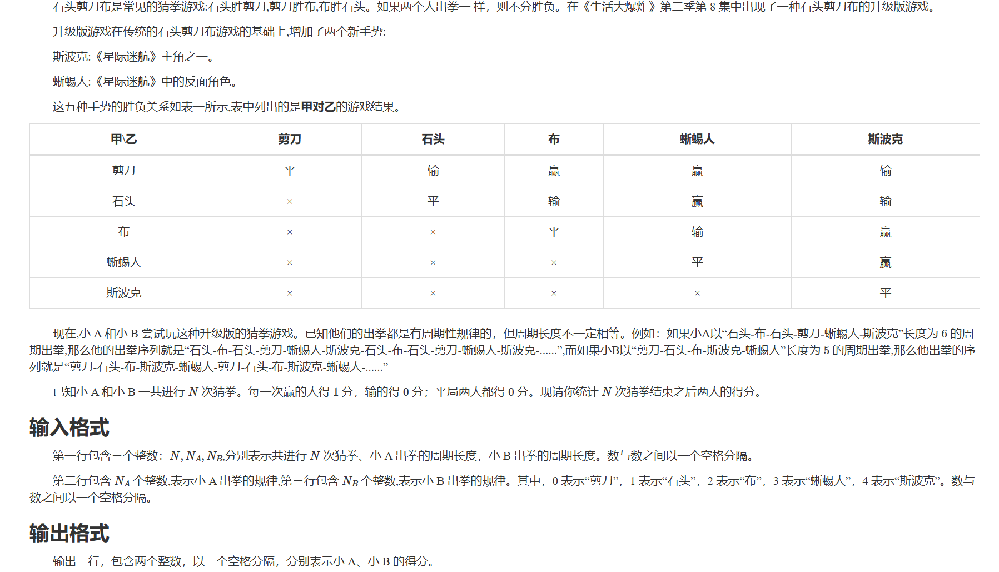

# 模拟算法
## 简介
模拟就是用计算机来模拟题目中要求的操作 ,考试中写错是相当浪费时间的。
- 在动手写代码之前，在草纸上尽可能地写好要实现的流程。
- 调试时分块调试。模块化的好处就是可以方便的单独调某一部分。

## 例题：
一只长度不计的蠕虫位于 𝑛
n 英寸深的井的底部。它每次向上爬 𝑢
u 英寸，但是必须休息一次才能再次向上爬。在休息的时候，它滑落了 𝑑
d 英寸。之后它将重复向上爬和休息的过程。蠕虫爬出井口需要至少爬多少次？如果蠕虫爬完后刚好到达井的顶部，我们也设作蠕虫已经爬出井口。
### 思路
倒数第二次必然没有爬出来，倒是倒数第一次会爬出来。
临界情况是 n=u
k*(u-d)+u = n
k = (n-u)/(u-d)
k 为整数
k*(u-d)+u < n < k*(u-d)+2u

coding：
```cpp
int n,u,d;
cin>>n>>u>>d;
int k = (n-u)/(u-d);
if(k*(u-d)+u<n) k++;
cout<<k;
```

或者：
``` cpp

#include <iostream>

int main() {
  int n = 0, u = 0, d = 0;
  std::cin >> u >> d >> n;
  int time = 0, dist = 0;
  while (true) {  // 用死循环来枚举
    dist += u;
    time++;
    if (dist >= n) break;  // 满足条件则退出死循环
    dist -= d;
  }
  std::cout << time << '\n';  // 输出得到的结果
  return 0;
}
```

## 上真题：
### https://uoj.ac/problem/15



Coding:
```cpp:

#include <iostream>
#include <vector>
using namespace std;

bool isWin(int a, int b) {
    if (a == b) return false; // 平局
    if (a == 0 && (b == 2 || b == 3)) return true; // 剪刀赢布、蜥蜴人
    if (a == 1 && (b == 0 || b == 3)) return true; // 石头赢剪刀、蜥蜴人
    if (a == 2 && (b == 1 || b == 4)) return true; // 布赢石头、斯波克
    if (a == 3 && (b == 2 || b == 4)) return true; // 蜥蜴人赢布、斯波克
    if (a == 4 && (b == 0 || b == 1)) return true; // 斯波克赢剪刀、石头
    return false;
}

int main() {
    int N, NA, NB;
    cin >> N >> NA >> NB;

    vector<int> A(NA), B(NB);
    for (int i = 0; i < NA; ++i) cin >> A[i];
    for (int i = 0; i < NB; ++i) cin >> B[i];

    int scoreA = 0, scoreB = 0;

    for (int i = 0; i < N; ++i) {
        int a = A[i % NA];
        int b = B[i % NB];

        if (isWin(a, b)) scoreA++;
        else if (isWin(b, a)) scoreB++;
    }

    cout << scoreA << " " << scoreB << endl;

    return 0;
}
```
http://bailian.openjudge.cn/practice/3750/
没写出来。。。